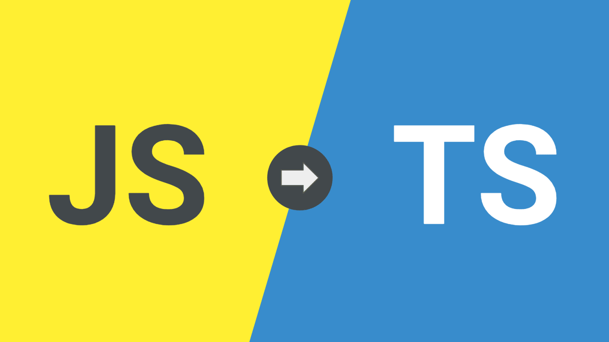

In the realm of website development, JavaScript has long been recognized as a cornerstone for creating interactive and dynamic web applications. However, as the world continue to advance, the demand more robust, scalable, and maintainable codebases has increase, JavaScript while highly flexible and widely adopted has shown limitation particular in managing large-scale applications. In response to this challenges, TypeSript, the superset of JavaScript was introduced, it designed to bring the strong typing, enhanced tooling, and modern programming paradigms to JavaScript development, TypeScript addresses many of shortcoming faced by developer. 

Initially, I underestimated the power of TypeScript. JavaScript has been the dominant language for web development since its interception in 1990s enabling dynamic client interaction and server-side programming. It has been a critical component in advanced frameworks such as React, Angular, and Vue.js. JavaScript primary strength line is flexibility and powerful capabilities. JavaScript being a dynamically typed, JavaScript allows for rapid development and adption. However, this flexibility can sometimes result in errors and inconsistence in handling larger project.

```cpp
// JavaScript: No type definitions
function greet(name, age) {
  return `Hello, my name is ${name} and I am ${age} years old.`;
}

// Using the function
const message = greet("Alice", 30);
console.log(message);

```

In constrast, TypeScript is a statically typed, which provides several advanced that TypeScript can be strongly typing ensure that the error are caughtr during the development, make the code more reliable. Additionally, TypeScript is more readable and maintainanable than JavaScript, it supports abstraction through interface while JavaScript does not. Typescript also allows developers to annotate code with decorators, and support better modularization and organization through the use of namespace, which is not supported in JavaScript. Furthermore, TypeScript is more expressive syntax than JavaScript through the use of syntax elements such as optional and name parameters, which enhanced its functionality and make development more efficient.

```cpp
// TypeScript: Explicitly defining types
function greet(name: string, age: number): string {
  return `Hello, my name is ${name} and I am ${age} years old.`;
}

// Using the function
const message: string = greet("Alice", 30);
console.log(message);

```

TypeScript basically not competitor with JavaScript but rather complement to it. By building on JavaScript foundation, TypeScript provides the community with more dynamic, full-featured and safer way to develop enterprise-grade applications where the target runtime requires JavaScript. The goal of TypeScript is not to replace JavaScript encourage the proliferation of JavaScript-based platforms by making it easier to write, integrate, more manageable and more maintainable. 

In conclusion, it's a great opportunities to mastering both JavaScript and TypeScript. JavaScript enables the creation of functional code wile TypeScript enhanced it by making the code more robust and maintainable. Together, they provide developers with the tools to create high quality web applications that meet modern demands.
