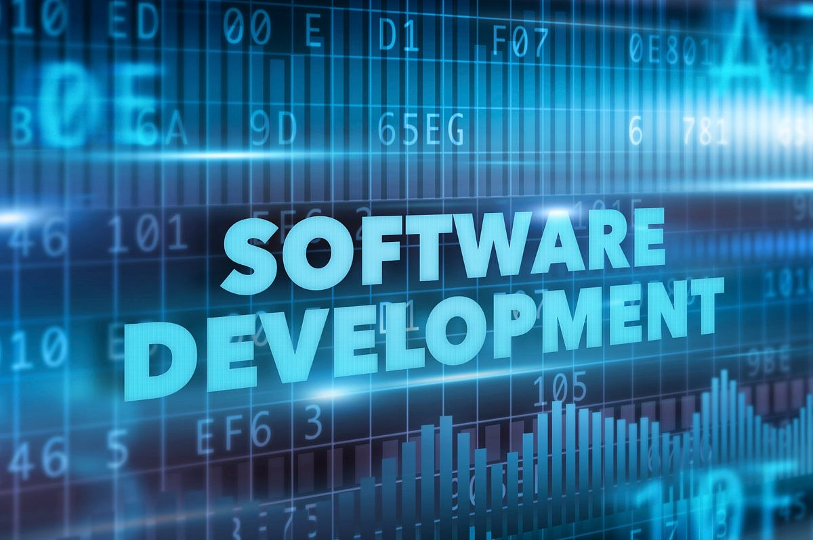

Software engineering has always fascinated me because of its unique blend of creativity, problem-solving, and critical thinking. It transforms abstract ideas into functional solutions that can address real-world problems—ranging from designing user interfaces to optimizing complex algorithms. I am particularly interested in full-stack development and artificial intelligence because I believe I can contribute something innovative to the world. I enjoy breaking down big problems into smaller pieces and tackling them step by step. It’s incredibly rewarding to find solutions, whether it’s creating a personal website or developing a small app for my profile.

My experience working with other students on group projects in college has taught me the importance of effective communication, breaking down problems, and staying calm under pressure when faced with challenges. I am eager to develop a wide range of technical and interpersonal skills to become a better software engineer. I aim to deepen my knowledge of programming languages and hope to become familiar with at least six of them. On the interpersonal side, I am committed to improving my ability to collaborate with teams, practicing daily, and continuously learning new concepts.

I see software engineering as a dynamic and evolving field that offers limitless opportunities for growth. By continuously learning and embracing challenges, I aspire to create software solutions that are not only technically sound but also meaningful and impactful in the real world. I’m excited about the journey ahead.

<em>Resources: ChatGPT for grammar checking.</em>
