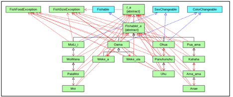

<div class="text-center p-4">
  
  
  
</div>

Fish game is a project that we assignment for our final exam. This project made by using Java. In this project, our team assigned to create a game that allow 2 players catch the fish, each player is given 3 opportunities to catch the fish using one of the 5 methods: pole, net, spear, trap, or throw net. Each species of fish has a unique method to catch that deemed to be legal. The program also allows users to check if the fishs they catched are legal or not. and allow users to keep or release if it legal. Because of this, it's very important to check the legal of the fish. The fish will keep grow bigger every month, it's advance to catch the right fish at the right time.

For this project, I was the team member who was responsible for programming GUI and servaral function of catching method.  I started by programming the basics, such as asking user to choose their method and if user catch the fish successful, the program will ask them check the rulebook to see if it's legal or not, then it's user turn to decide to keep or release the fish.  From there, I will match the code with my team member to determine the winner from there. 

Here is some code that illustrates how we read values from the line sensors:

```cpp
public MoiMana() {
      super("Moi Mana", MOIMANAMAXLENGTH, MOIMANAMINLENGTH, 
         MOIMANAMINLENGTH, (MOIMANAMINLENGTH * 2), DIET_ITEMS,  "silver", 
         "silver with black tips", "male"); 
      //method is in superclass but will use max, min length set above
      this.initLength();  
   }

```
