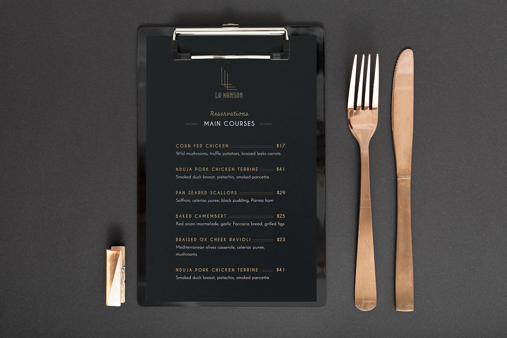

La-Manson is a branding project that I create while learning Adobe Photoshop in Vietnam. The project helped me learn how to design a professional branding for the website.

La-Manson is implemented using Adobe Photoshop, a HTML/CSS to create a website. Within one month, I created a website that implements several types of services in the La-Mason restaurant including booking a table, display the menu, and order through the website.

In this project I gained experience with full-stack web application design and associated technologies, CSS Framework for the user interface, and Javascript for both client and server-side programming. 

Here is some example branding pictures use:

