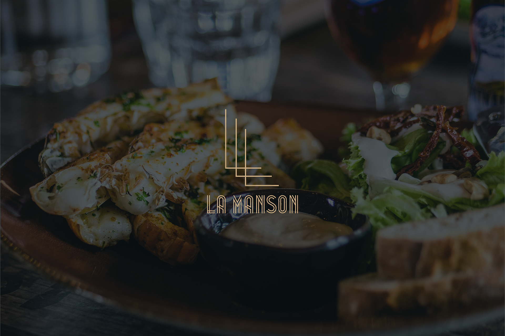
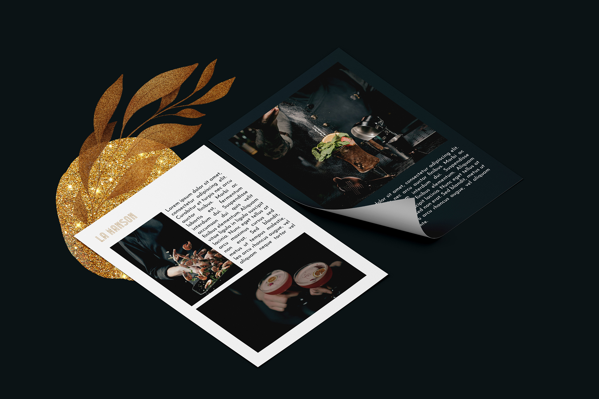
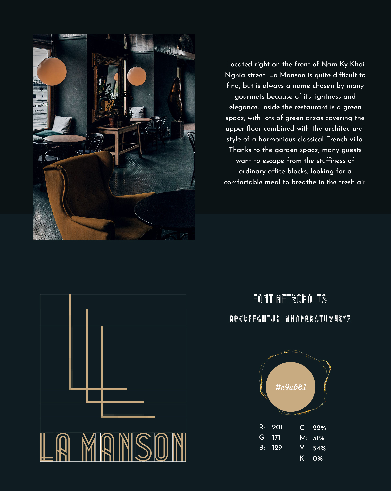
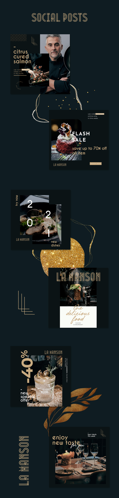

The Evolution 7 is a project that I create while learning ITS in Vietnam. The project helped me learn how to design a professional and functional the website.

The Evolution 7 is implemented using Adobe Photoshop, a HTML/CSS, and Javascript to create a professional and functional website to represent the company. Within 6 months, me and my team created a website that implements several types of services including Digital strategy, Logo creative, Web design, and Illustration.

In this project I gained experience with full-stack web application design and associated technologies, CSS Framework for the user interface, and Javascript for both client and server-side programming. 

Here is some example branding pictures use:

